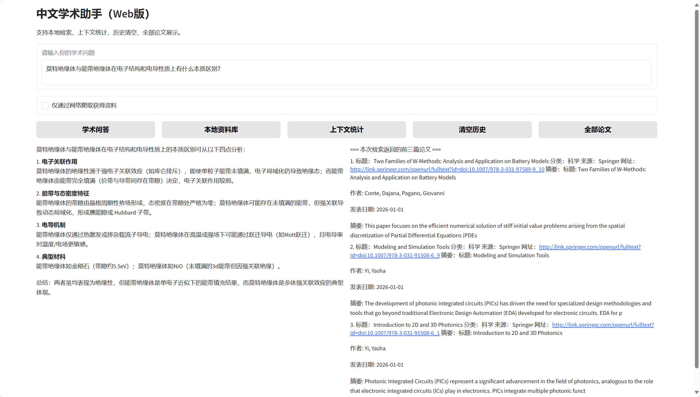
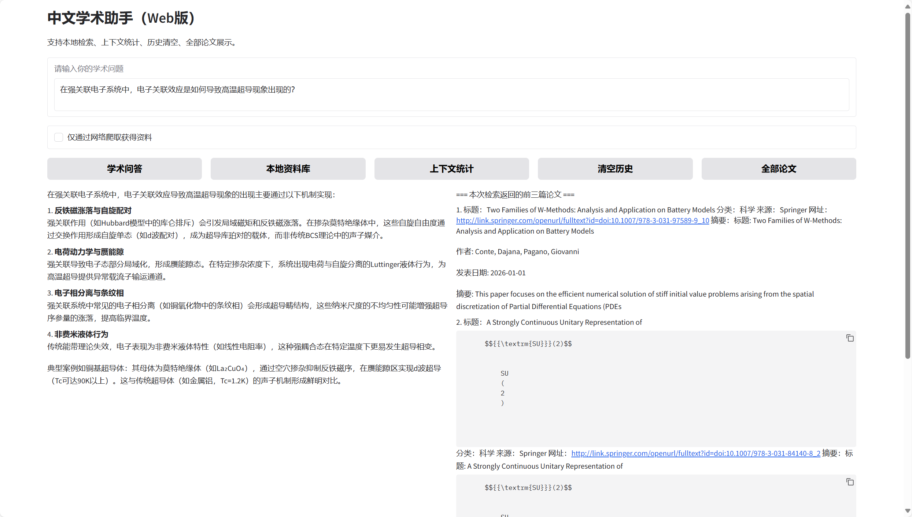
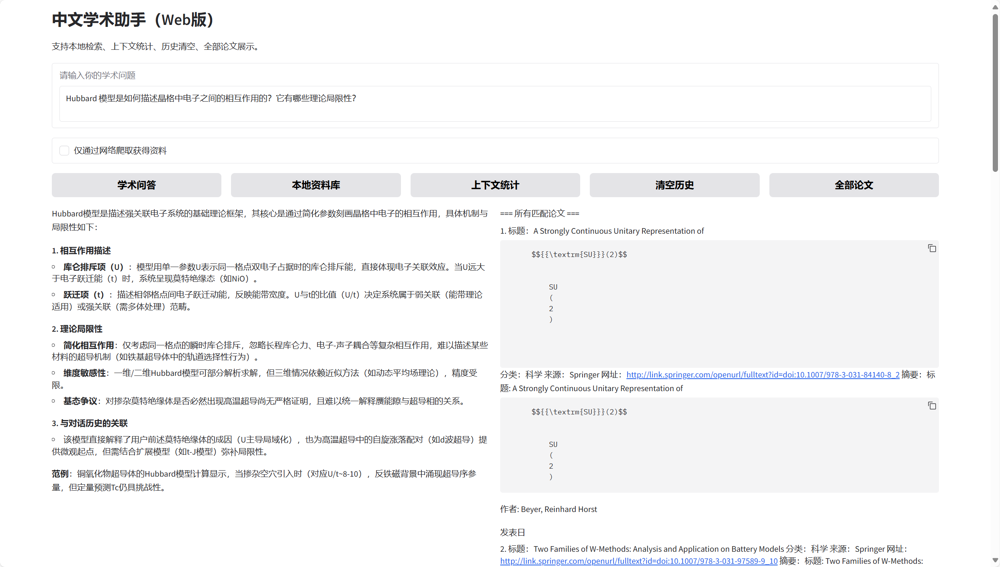
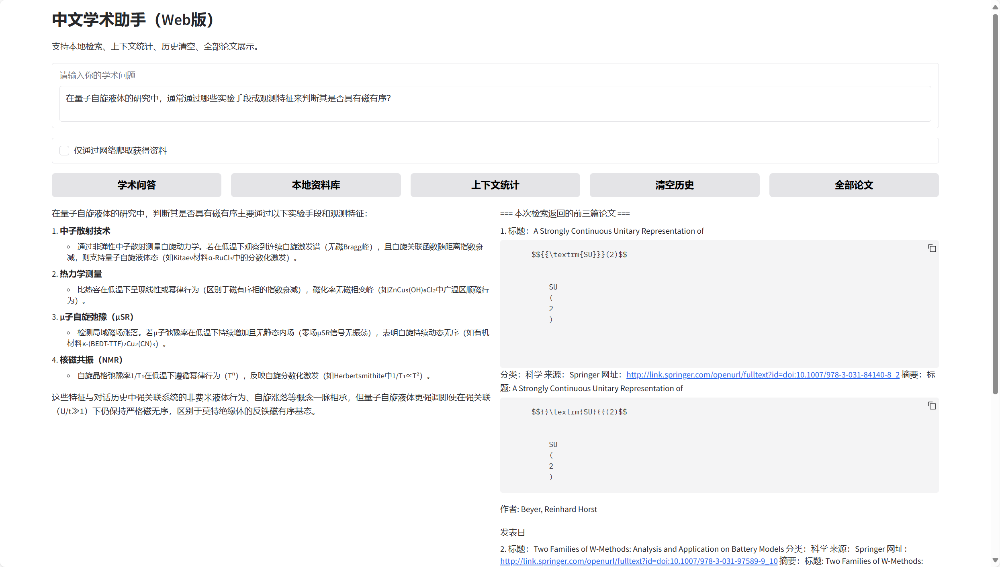
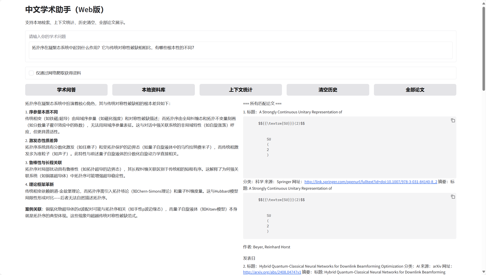
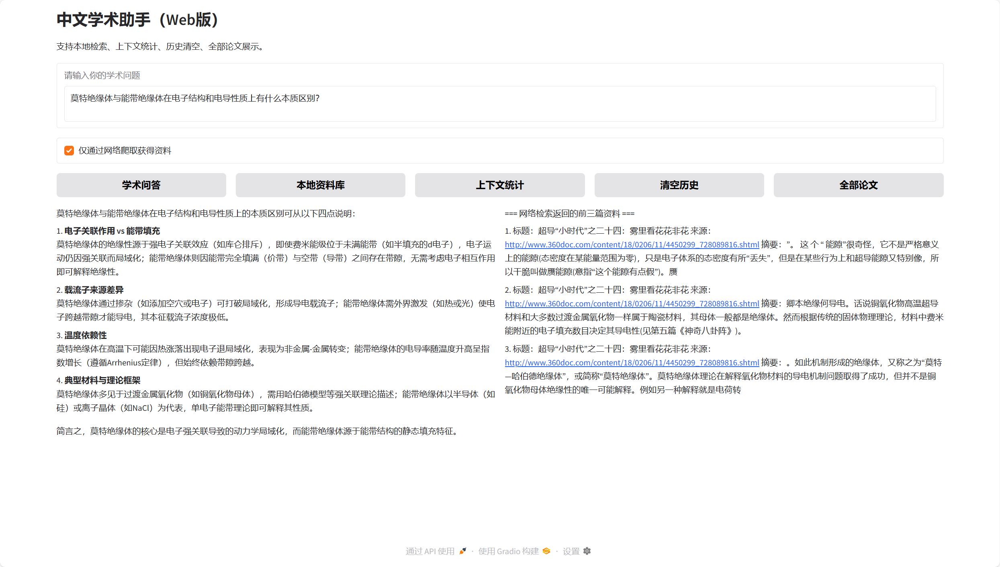
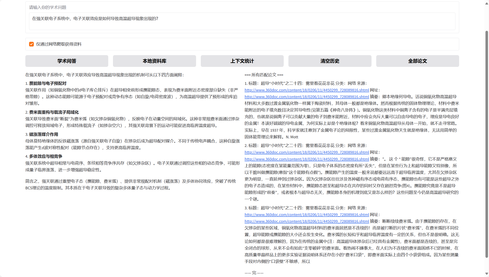
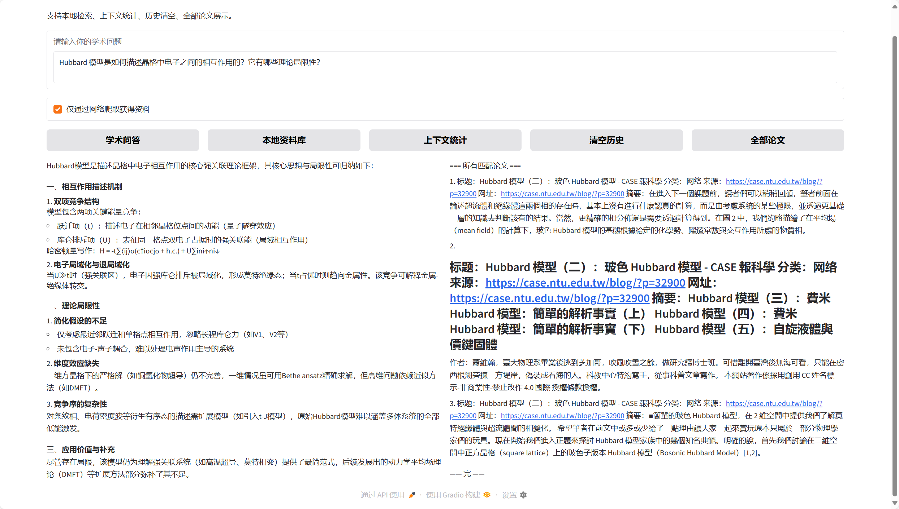
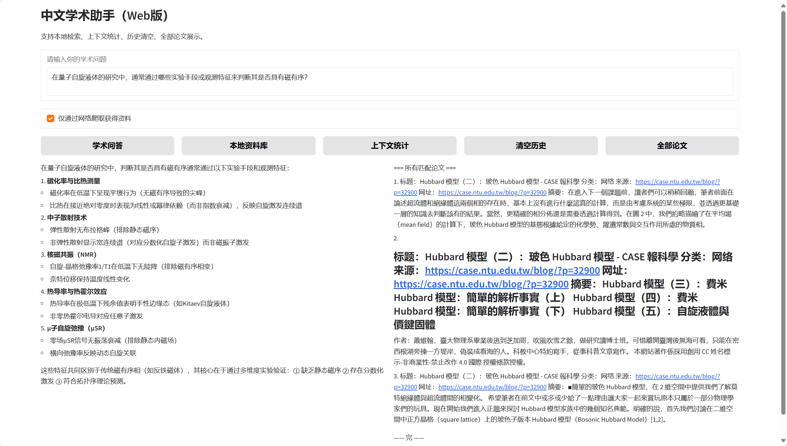
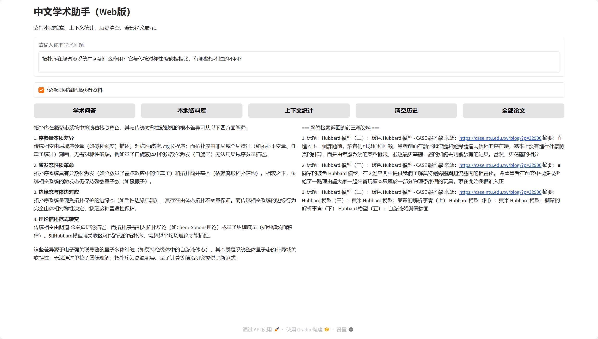

## 项目介绍

这是一个AI论文助手，可以根据用户的问题做出总结回答，并提供论文来源和摘要，包含一个约200篇不同论文的本地资料库

以及可选的网络检索资料功能

使用SentenceTransformers进行文本向量化，Chroma 向量数据库实现本地语义向量检索，langchain管理上下文


内置了一些小工具小爬虫用来丰富本地资料库

可打开的：

点击start.bat运行主程序

fix_encoding.py用来修复中文乱码问题，运行可以修复本地库（疑似不是特别好用）

search.py，这个是写的小爬虫，可以拿来按关键词给本地爬论文


不用打开的：

写了context_manager用来实现上下文管理，增强上下文联系功能

local_docs_manager用于管理本地的论文的各种信息，方便检索和引用

online_models用来管理各种可选的在线模型，实际上因为我只给deepseek爆了米我测试一直只用了ds ：）


主程序的功能包括：问答，查看本地资料库，展示所有匹配论文，清空对话记录，查看上下文统计，网络检索开关

都已经用gradio集成成按钮了，可以一键舒爽

## 使用方法

首次下载完之后复制example_env.txt为 .env文件（文件名空白），填入自己的apikey

之后就可以正常使用了，首次运行程序start.bat会自动下载本地轻量模型并建立虚拟环境安装依赖

不要管app.py，在使用gradio之后很多修改没有再去app.py里改了，它算是个半成品

直接运行bat即可

点击start.bat脚本会自动激活虚拟环境并打开默认浏览器跳转到ai学术助手界面

启动的时候最好挂着梯子（不要开全局），不然有时候连不到langchain，但是不联网也能打开

联网搜索功能在使用前一定把梯子切换到全局！不如搜索api会被墙TAT

每次使用助手的第一次提问下面没有读秒，请不要过多点击，后面就有显示了

如果你想更换话题，询问别的领域，最好清空一下对话记录，不然程序联系上下文可能会拿跨领域的东西给你比喻


PS：虽然程序里有个小体量的本地模型，但是十分不推荐使用，推理的真的很慢而且对话能力不强

我给deepseek充了10r大米，测试请用我的key，因为要交GitHub，key我私发

## 效果展示

下面是一段GPT生成的物理学方面问题，我分别截图了本地检索和网络检索两个版本的回复

凝聚态物理方向中文问答问题（5 连问）

**问题 1：**
 莫特绝缘体与能带绝缘体在电子结构和电导性质上有什么本质区别？

**问题 2：**
 在强关联电子系统中，电子关联效应是如何导致高温超导现象出现的？

**问题 3：**
 Hubbard 模型是如何描述晶格中电子之间的相互作用的？它有哪些理论局限性？

**问题 4：**
 在量子自旋液体的研究中，通常通过哪些实验手段或观测特征来判断其是否具有磁有序？

**问题 5：**
 拓扑序在凝聚态系统中起到什么作用？它与传统对称性破缺相相比，有哪些根本性的不同？

### 本地检索











本地检索每次提问的响应时间约为10~20s

### 网络检索











相同问题，网络检索的响应时间慢10s左右

### 补充说明

本地资料库我爬的大部分是ai和医学相关的，对于这两个方面的问题，程序的回答效果更好

科学分类里面杂了很多领域，论文的量其实不多，只爬了一部分热点关键词，虽然效果展示这里用的是物理学

## 常见问题解决！！！

虽然我依赖写了gradio版本，但是有时候还是会下载成新版，导致web白屏！
所以如果你发现web白屏，请如下解决：
在cmd根目录路径下激活虚拟环境：

```
.venv\Scripts\activate
```

卸载当前版本的gradio：

```
pip uninstall gradio gradio-client -y
```

安装需要的版本：

```
pip install "gradio==3.50.2"
```

（可选）检查一下版本是否为3.50.2

```
pip show gradio
```

更改后再次运行start.bat或在cmd运行gradio_app.py即可
